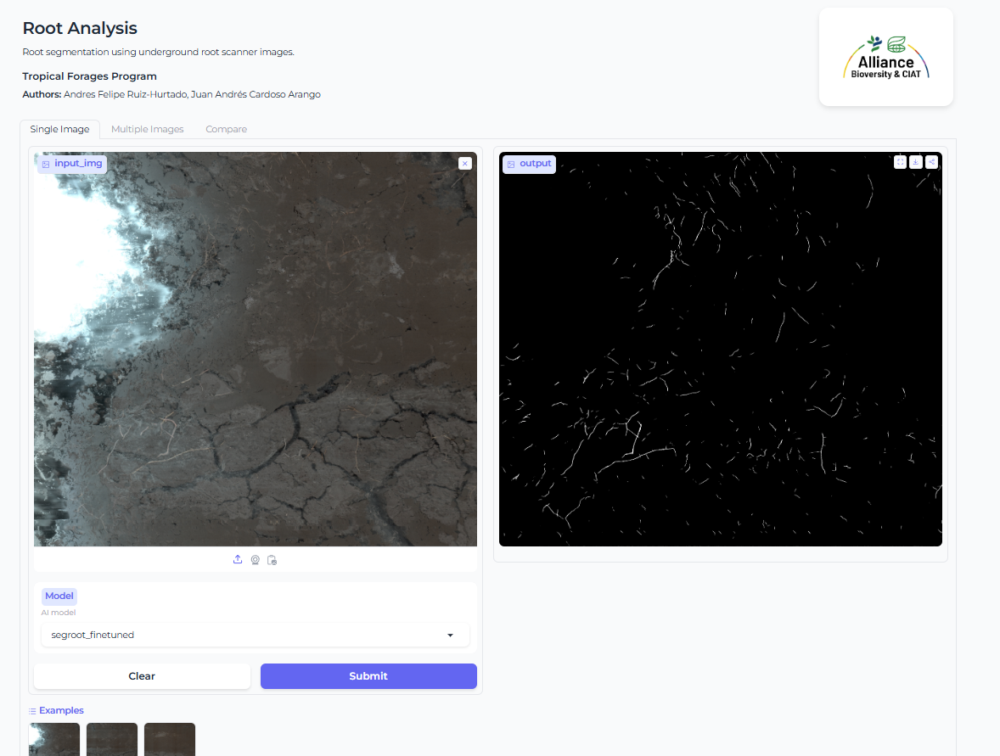

# root_analysis
AI tool for root segmentation and analysis in tropical grasses

[](https://huggingface.co/spaces/anfruizhu/root_analysis)


## Overview

The **root_analysis** is the initial version of an AI-driven application for segmenting and analyzing root morphology in underground minirhizotron non-destructive root images of tropical grasses. It is designed to provide accurate and efficient root analysis for researchers. This tool is available as a Gradio web application on Hugging Face, with options for local execution.


## Features
- **Root segmentation**: segment underground root systems.
- **Web application**: Deployed on Hugging Face for quick online access.
- **Local execution**: Run the application offline.

## Getting Started

### 1. Online Usage (Gradio Web App)
Access the deployed web app on Hugging Face:
[**Root Analysis Web App**](https://huggingface.co/spaces/anfruizhu/root_analysis)

### 2. Local Execution

#### Prerequisites
- Python 3.12 or higher
- Git

### Dependencies
This project uses models and code from [**https://github.com/wtwtwt0330/SegRoot**](https://github.com/wtwtwt0330/SegRoot)

#### Steps
1. Clone the repository:
   ```bash
   git clone https://github.com/afruizh/root_analysis
   cd root_analysis/webapp
   ```
2. Install dependencies:
   ```bash
   pip install -r requirements.txt
   ```
3. Run the tool locally:
   ```bash
   python main.py
   ```
4. Open your browser and navigate to `http://localhost:7860` to access the app.

## License
This project is licensed under the Apache-2.0 license.

## Authors
Tropical Forages Team

Alliance Bioversity International & CIAT